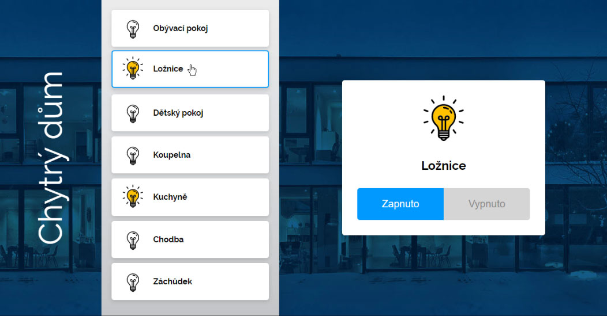

# Chytry dum

## Instalace a spuštění aplikace

Aby se dal zdrojový kód rozumně everyovat v GITu nebo posílat po internetu, je z projektu odstraněna složka node_modules, která obsahuje tisíce malých souborů potřebných pro běh workflow spojeného s Vue CLI.

Po stažení projektu otevři složku *chytry-dum* v editoru. Otevři příkazovou řádku (buď v editoru - viz. dále, nebo normálně ve Windows/macOS), dostaň se dovnitř složky projektu a spusť příkaz *npm install*. Všechny potřebné soubory se ti doinstalují a pak můžeš projekt spouštět normálně pomocí *npm run serve*

**Příkazová řádka přímo v editoru**
VS Code přímo v sobě obsahuje příkazovou řádku. Nemusíš ji tedy ve Windows/na Macu spuštět zvlášť. Příkazová řádka v editoru je také automaticky otevřená ve složce s projektem, takže se do složky nemusíš zdlouhavě dostávat.

Příkazovou řádku v editoru otevřeš v menu *Terminal > New Terminal*.

## Úkol

Dokonči projekt Chytrý dům, který má zobrazovat seznam světel v domě a jejich stav (zapnuté/vypnuté). Po kliknutí na světlo v seznamu se zobrazí jeho detail, kde se dá světlo pomocí tlačítek Vypnuto/Zapnuto přepínat.

V kořenové složce projektu se podívej na "instruktážní" video *navod-video.mp4*. Tam vidíš, jak by měla aplikace nakonec vypadat a fungovat.

Abyste měly z aplikace alespoň trochu radost, snažil jsem se ji pro vás nastylovat do zajímavé/hezké podoby. To s sebou ale nese podmínku, že musíš dodržet strukturu a použité CSS třídy, které jsem předpřipravil.

Ve složce *components* už máš vytvořené soubory *Detail.vue* a *Seznam.vue*. Je v nich kompletní vzorové HTML - ty musíš pouze některé části, které jsou tam napsány na pevno, vyměnit za dynamické hodnoty - tj. místo napevno napsaného názvu světla `Podkroví` použiješ asi `{{ svetlo.nazev }}` nebo něco podobného.

U všeho, co máš něčím nahradit, je komentář a podrobný popis.

Do komponent budeš muset předávat nějaké props. Komponenty budou vyvolávat vlastní událost, pomocí které bude do rodičovské App posílat informace o tom, na jaké světlo uživatel klikl a jehož detail se má zobrazit.

## Bonusové úkoly

Pokud si chceš dál hrát, tak super. Sama/sám zkus třeba:

- Přidat nad seznam světel dvě tlačítka, pomocí kterých půjdou zhasnout nebo rozsvítit všechna světla najednou (jdu spát -> chci zhasnout celý dům)
- Doplnit do pole ke světlům třeba intenzitu - představ si, že každé světlo jde stmívat a rozsvěcet a ty si tak můžeš v domě udělat třeba hezkou intimní atmosféru :) V detailu světla by pak mělo jít světlo zapnout/vypnout a nastavit jeho intenzita. Intenzita půjde nastavit v rozmezí 0–100.
- Intenzitu nějak hezky zobraz i v přehledu světel - napadá mě třeba svislá čárka na pravé straně bublinky se světlem, která bude tak vysoká, jak vysoká bude intenzita.
- Co třeba barva světla?
